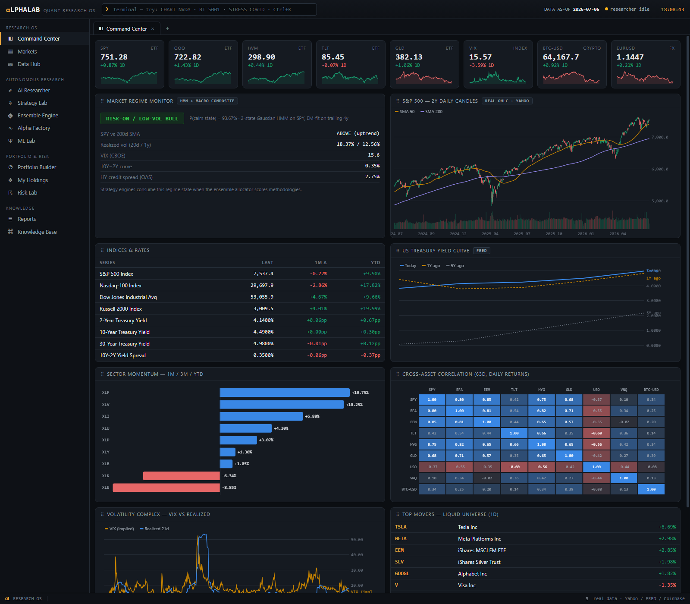
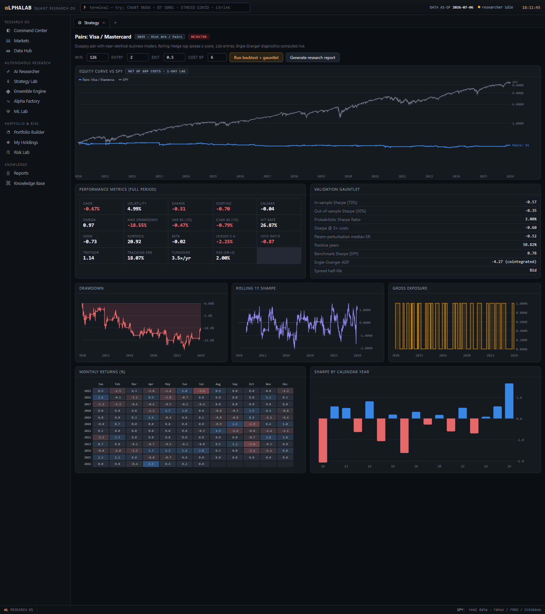
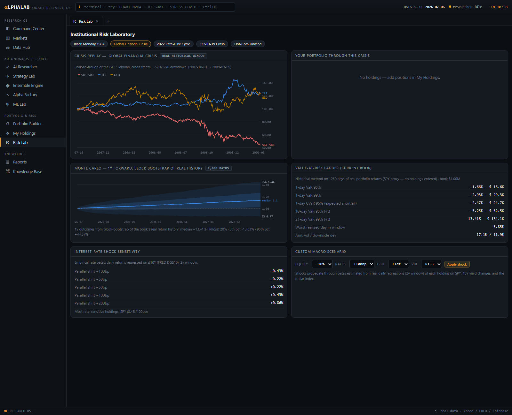
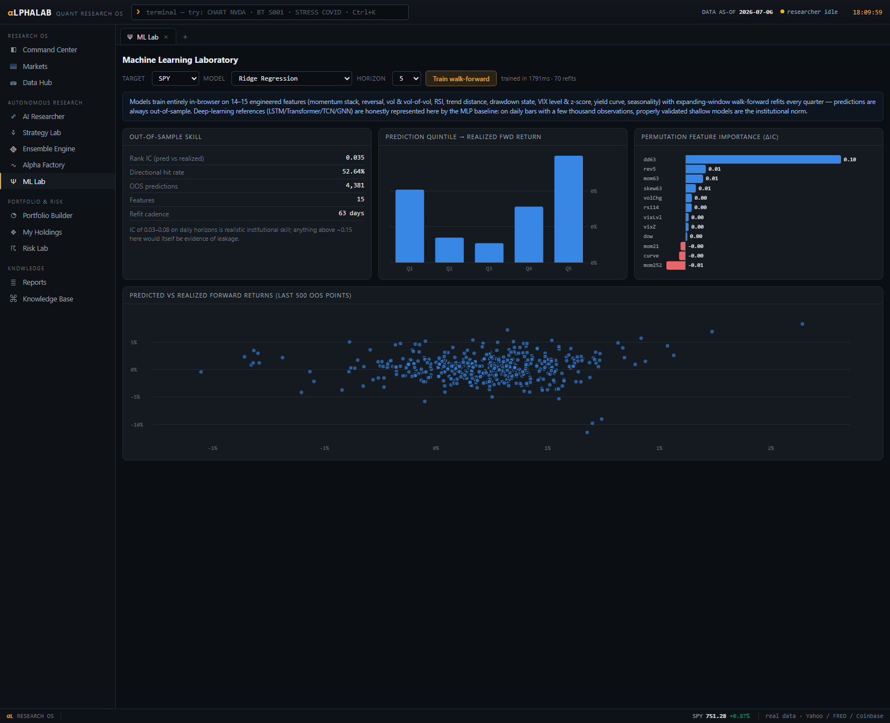

# AlphaLab, an Autonomous Quantitative Research OS

**A Bloomberg-terminal-style research platform that runs entirely in your browser, on real market data. One HTML file. No server, no API keys, no install. Built for serious research and for competitions like the Wharton Global Investment Competition.**

<p>
  <a href="https://boytiger-1.github.io/alphalab/"><b>Launch AlphaLab</b></a> ·
  <a href="#new-to-investing-start-here">Beginner guide</a> ·
  <a href="#wharton-investment-competition-playbook">Wharton playbook</a> ·
  <a href="#stock-advisor-and-sentiment-intelligence">Stock Advisor</a> ·
  <a href="#terminal-commands">Commands</a> ·
  <a href="#the-modules">Modules</a> ·
  <a href="#faq--troubleshooting">FAQ</a>
</p>



## What it does

AlphaLab does the work of a quantitative research team in a single self-contained page:

- **Buy / Sell Decision engine**: type any ticker and get one screen fusing eight technical factors, real fundamentals (P/E, growth, margins, balance sheet), Wall Street analyst price targets and the full buy/hold/sell split, earnings-surprise history, real news headlines, and real investor posts into a single BUY, HOLD, or SELL with a bull case and a bear case
- **Interactive guided tour**: a spotlight tutorial that drives the real app for you, one screen at a time, so a first-time user learns the whole workflow in minutes
- **Fundamental screener and peer comparison**: filter 4,400+ stocks by value, growth, quality, dividends, or analyst upside, and line any stock up against its sector rivals
- **Stock Advisor**: ranks every listed US stock, over 4,400 names, on twelve factors (technical momentum and trend, risk-adjusted return, volatility, consistency, sector-relative strength, regime fit, sentiment, plus fundamental valuation, quality, growth, and analyst upside) (momentum, trend, risk-adjusted return, volatility, consistency, market-regime fit, and real sentiment) and explains each pick in plain English, with suggested position sizes and confidence levels
- **Real sentiment intelligence**: worldwide news tone and coverage volume from GDELT, investor social sentiment from StockTwits, and public attention from Wikipedia pageviews, bundled per ticker and refreshable live from the browser
- **Portfolio management**: enter or CSV-import any portfolio, track it against real closing prices, get an AI review with statistical justification, and generate a written Investment Strategy Report ready to print
- **Competition mode**: one click gives you $100,000 of virtual cash with full buy/sell cash accounting, built for contests like the Wharton Global Investment Competition
- **Investment Firm Simulator**: run your own fund through a hidden three-year window of real market history with AI analysts (macro, quant, risk) who debate your decisions, real crises arriving on schedule, 2-and-20 fees, investor flows, and a final grade
- **Quant Toolkit**: a PCA market-structure map with clustering, a no-code Strategy Composer wired into the full validation pipeline, a seasonality explorer with significance tests, and a drawdown analyzer
- **118 strategy research modules**: trend, momentum, pairs arbitrage, volatility, factor investing, macro, seasonality, crypto, machine learning, and allocation, each backtestable with honest costs and a 5-stage validation gauntlet
- **An autonomous AI researcher** that invents hypotheses, tests them on real history, and files every result (including failures) into a persistent knowledge base
- **A risk laboratory**: replay your exact portfolio through 2008, COVID, 2022, the dot-com crash, and Black Monday 1987, plus Monte Carlo simulation, VaR ladders, and rate-shock sensitivities
- **A built-in guide** that explains every screen and every number in plain English, written for people who have never invested before

Everything computes on real data across three tiers: 78 flagship instruments (majors, ETFs, futures, FX, crypto) with full daily history back to 2000 (S&P 500 back to 1970), every S&P 500 constituent with 10 years of weekly prices and sector labels, and every listed US common stock above a small size floor, about 3,900 more names, with 3 years of weekly prices (the same coverage idea as a total-market index fund). On top of prices, the platform bundles real per-stock fundamentals for about 900 large-caps from Yahoo Finance (valuation, growth, margins, balance sheet, analyst price targets and recommendation splits, earnings surprises), real news headlines from GDELT, and real investor posts from StockTwits. Macro comes from FRED, crypto from Coinbase, attention from Wikipedia. Nothing is simulated. A GitHub Action refreshes the whole snapshot on weekday mornings, and the decision engine can pull the latest headlines live from your browser.

## The Buy / Sell Decision engine

The fastest way to judge a single stock. Type a ticker and AlphaLab fuses, all on real data:

- **Technical** (28% weight): the eight-factor momentum, trend, volatility, and consistency read
- **Analyst** (20%): upside to the mean price target, the strong-buy-to-strong-sell consensus split, and the earnings-surprise track record
- **Quality** (14%): profit margins, return on equity, and leverage
- **Growth** (14%): revenue and earnings expansion
- **Value** (14%): valuation multiples versus sector peers
- **Sentiment** (10%): news-tone trend and investor-post lean

It prints a single **BUY, HOLD, or SELL** with a composite score, a bull case and a bear case built from the specific real numbers, the analyst target panel, the earnings-surprise table, real news headlines, real StockTwits posts, and a plain "what would change this call" note. Every reason is a number you can cite, and it never trades for you.

## New to investing? Start here

The site opens with a welcome screen offering a **guided tour**: an interactive tutorial that drives the real app for you, opening each screen and pointing at what matters. It is the fastest way to learn AlphaLab. There is also a full written **How To Use This** guide in the left menu. That guide contains a five-step walkthrough, a dictionary of every financial term on the site (Sharpe ratio, drawdown, VaR, beta, backtest, and the rest), a description of what every module is for, and a warning section on how to read results without fooling yourself. You need zero finance background.

The short version:

1. Press `Ctrl+K`, type a ticker like `AMZN`, press Enter. That is the stock's real history, including every painful drop.
2. Open **Stock Advisor** and press "Score the universe". Read the plain-English reasoning on each pick.
3. Open **My Holdings**, press **Competition mode ($100K)**, and add positions (the Advisor can add them for you and deducts the cash).
4. Open **Risk Lab** and see what 2008 or COVID would have done to your exact portfolio, in dollars.
5. Back in My Holdings, press **Strategy report** for a written investment strategy document.

## Wharton Investment Competition playbook

The Wharton Global Investment Competition gives teams roughly $100,000 in virtual cash and judges **strategy and reasoning**, not just returns. AlphaLab maps to that directly:

| Competition need | Where it lives in AlphaLab |
|---|---|
| Manage a $100K virtual portfolio | My Holdings, Competition mode: cash accounting on every buy and sell at real closes |
| Pick stocks with defendable reasons | Stock Advisor: seven-factor scores plus a written thesis per stock you can cite |
| Show sentiment/news awareness | Sentiment & News desk: real GDELT news tone, StockTwits crowd lean, Wikipedia attention |
| Demonstrate risk management | Risk Lab: crisis replays, Monte Carlo, VaR; the numbers judges want to see quantified |
| Submit a strategy document | My Holdings, Strategy report: objectives, per-holding rationale, risk analysis, benchmarks, monitoring plan, printable to PDF |
| Rebalance with discipline | AI portfolio review flags concentration, beta drift, and regime changes weekly |

The in-app guide has the full six-step playbook. Edit the generated report in your own voice before submitting.

## Stock Advisor and sentiment intelligence

The Advisor scores the full equity universe on:

1. **Momentum**: 6-month return with a 2-week skip
2. **Trend**: distance from the 200-day moving average
3. **Sharpe**: 1-year risk-adjusted return
4. **Low volatility**: calmer names score higher
5. **Consistency**: share of positive months over 3 years
6. **Regime fit**: the platform detects the market regime with a hidden Markov model and favors aggressive names in calm tapes, defensive names in stress
7. **Sentiment**: a composite of GDELT news tone trend, StockTwits bullish/bearish message mix, and Wikipedia attention spikes

Each recommendation shows the factor breakdown, a bootstrap next-quarter return range from the stock's own real history, statistical confidence, correlation to your current holdings (does it actually diversify you), and a plain-English thesis. Suggested basket weights are inverse-volatility with a cap near 18% per name. Every screen repeats the honest framing: these are ranked research views of historical and sentiment data, not predictions, and AlphaLab never executes trades.

The **Sentiment & News** desk shows the raw feeds per ticker and has a "Refresh live" button that re-pulls Wikipedia and GDELT straight from your browser when online (the bundled snapshot is the fallback).



## Terminal commands

Press `Ctrl+K` anywhere, or type into the command box in the top bar.

| Command | What it does |
|---|---|
| `CHART <sym>` | Chart workspace: candles, drawdown, rolling vol and beta, return distribution |
| `COMPARE <a> <b> [c] [d]` | Indexed comparison chart |
| `ADVISE` | Open the Stock Advisor |
| `SENTIMENT <sym>` | News tone, social sentiment, and attention for a ticker |
| `WHARTON` | Set up Wharton competition mode ($100K virtual cash) |
| `GUIDE` | Open the plain-English guide |
| `BT <id>` | Open a strategy backtest workbench, e.g. `BT S001` |
| `RESEARCH START` / `STOP` | Engage or pause the autonomous researcher |
| `FACTOR SCAN` | Generate and test 25 candidate alpha factors |
| `STRESS <scenario>` | Crisis replay: `2008`, `COVID`, `2022`, `DOTCOM`, `1987` |
| `GO <module>` | Jump anywhere: `DASH`, `MARKETS`, `DATA`, `AI`, `ALPHA`, `STRAT`, `ML`, `PORT`, `HOLD`, `RISK`, `REPORTS`, `KB` |
| *(any symbol)* | Typing a known symbol charts it directly |

Deep links work too: `#risk`, `#advisor`, `#guide`, `#strat=S035`, `#chart=GLD`.

## The modules

| Module | What you do there |
|---|---|
| **How To Use This** | The full plain-English manual: five-step start, Wharton playbook, term dictionary, module map |
| **Command Center** | Market overview: regime monitor, yield curve, sector momentum, correlations. Drag panels to customize |
| **Markets** | Sortable screener of every instrument with real return/vol/Sharpe/drawdown stats |
| **Data Hub** | Dataset catalog, quality audit, CSV upload (your file becomes a first-class instrument) |
| **Stock Advisor** | Seven-factor stock recommendations with written theses and suggested weights |
| **Buy / Sell Decision** | One-screen verdict on any stock: technicals, fundamentals, analyst targets, earnings, news, and posts fused into BUY/HOLD/SELL with bull and bear cases |
| **Screener** | Filter 4,400+ stocks by real fundamentals: value, growth, quality, dividends, GARP, analyst upside |
| **Peer Comparison** | Line a stock up against its closest sector rivals on valuation and quality |
| **Sentiment & News** | Real news tone, coverage volume, social sentiment, and attention per ticker, with live refresh |
| **Market Structure** | PCA map of the whole index with k-means clusters: which stocks actually trade together |
| **Strategy Composer** | Build your own strategy from dropdowns, no code, run through the full validation pipeline |
| **Seasonality** | Calendar-month and weekday patterns with t-statistics to separate real effects from noise |
| **Drawdown Analyzer** | Every major historical decline: depth, fall time, recovery time |
| **Firm Simulator** | Manage a fund through a masked window of real history: sleeves, fees, investor flows, AI analyst committee, final grade |
| **AI Researcher** | The autonomous hypothesis loop with its experiment database |
| **Strategy Lab** | 118 strategy modules: configure, backtest, validate, generate reports |
| **Ensemble Engine** | Strategy competition and inverse-vol blending of uncorrelated winners |
| **Alpha Factory** | Machine-generated trading signals pushed through an IC gauntlet |
| **ML Lab** | Walk-forward model training with honest out-of-sample diagnostics |
| **Portfolio Builder** | Professional optimizers: risk parity, HRP, minimum variance, Black-Litterman, Kelly |
| **My Holdings** | Your portfolio: P&L at real closes, cash accounting, CSV import, factor betas, AI review, strategy reports |
| **Risk Lab** | Crisis replays on real windows, Monte Carlo, VaR ladder, rate shocks, custom scenarios |
| **Reports / Knowledge Base** | Every document and every finding, searchable and printable |



## The Investment Firm Simulator

Found a fund ($10M to $100M), deploy capital across validated strategy sleeves and stocks, and advance week by week through a hidden three-year window of real market history. Crashes, rate cycles, curve inversions, inflation prints, and single-stock shocks arrive exactly as they actually happened, with dates masked so you cannot look up the answers. A three-analyst AI committee reads the same real data and argues with you: the macro strategist watches vol, rates and credit; the quant tracks sleeve performance; the risk officer polices drawdown, leverage and concentration, and force-liquidates half the book past a 25% drawdown. You earn 2% management and 20% performance fees above the high-water mark, investors subscribe or redeem based on your numbers against the index, and at week 156 you get a letter grade plus the reveal of which era you survived. It turns strategy research into portfolio management practice.

## How validation works (read before trusting any backtest)

Every backtest applies a 1-day signal lag and linear transaction costs. A strategy is **VALIDATED** only if it passes all five checks: positive out-of-sample Sharpe on the final 30% of history, probabilistic Sharpe ratio above 85%, survival at triple costs, parameter-perturbation stability, and positive Sharpe in most calendar years. Most strategies get **REJECTED**. That is the platform working as intended: the Visa/Mastercard pairs module finds genuine cointegration (ADF near -4.3) yet still fails net of costs, which is the honest answer.



## Strategy catalog

| Category | Count | Examples |
|---|---|---|
| Trend Following | 12 | Golden Cross, Donchian breakouts, multi-asset managed futures, FX trend |
| Momentum | 12 | 12-1 time-series momentum, cross-sectional momentum, dual momentum, sector rotation |
| Mean Reversion | 10 | RSI(2), Bollinger reversion, VIX-spike contrarian |
| Stat Arb / Pairs | 10 | V/MA, JPM/BAC, gold/silver, with live cointegration diagnostics |
| Relative Value | 7 | Size spread, credit RV, defensives vs cyclicals |
| Volatility | 8 | Vol targeting, variance-risk-premium harvest, HMM regime switching |
| Factor Investing | 8 | Momentum/quality/min-vol tilts, value-growth spread, multi-factor blends |
| Macro / Regime | 10 | Yield-curve recession guard, credit-spread switch, Fed cycle, dollar regime |
| Carry / Seasonality | 7 | Turn-of-month, Halloween effect, commodity seasonals |
| Crypto | 8 | BTC trend, vol targeting, ETH/BTC rotation, cross-sectional momentum |
| Machine Learning | 8 | Ridge, logistic, boosted stumps, k-NN, MLP, ensemble vote, all walk-forward |
| Allocation | 6 | 60/40, Permanent Portfolio, All-Weather, ERC, HRP, minimum variance |
| Event-Driven and Alt-Data | 12 | Merger arb, PEAD, insider momentum: documented but deliberately inactive until you connect the required dataset, because faking that data would produce untrustworthy research |

## Rebuilding with fresh data

A GitHub Action ([refresh-data.yml](.github/workflows/refresh-data.yml)) refreshes everything on weekday mornings and redeploys the site. To run it locally:

```bash
python tools/download_data.py        # Yahoo + FRED + Coinbase price/macro history
python tools/download_data_meta.py   # instrument metadata
python tools/download_altdata.py     # GDELT news + StockTwits + Wikipedia attention
python tools/download_sp500.py       # every S&P 500 constituent, 10y weekly
python tools/download_market.py      # every other listed US stock, 3y weekly
python tools/build_bundle.py         # compact integer-scaled data bundle
python tools/assemble.py             # everything into dist/alphalab.html
node tools/smoke.js                  # 24-check test suite against the real bundle
```

Python 3 stdlib plus curl only. No pip installs.

## Architecture

```
app/
  core.js        data access, CSV ingestion, persistence, formatting
  quant.js       stats, performance analytics, backtester, HMM regime model,
                 optimizers (ERC/HRP/BL/frontier), Monte Carlo
  charts.js      canvas chart library with crosshair tooltips
  strategies.js  signal engines, backtest runner, validation gauntlet
  registry.js    the 118 strategy definitions
  factors.js     alpha discovery grammar and factor library
  ml.js          in-browser models and walk-forward engine
  researcher.js  autonomous hypothesis loop and report builder
  modules_*.js   the UI workspaces (Advisor, Sentiment, Guide, Quant Toolkit, Firm Simulator)
data/
  bundle.js      the market-data snapshot (shared trading calendar, integer-scaled)
  altdata.js     the news/social/attention snapshot
tools/           downloaders, bundler, assembler, smoke tests
```

No frameworks, no runtime dependencies. The assembler concatenates everything into one file.

## FAQ / troubleshooting

**Is the data real?** Yes. Prices from Yahoo Finance, macro from FRED, crypto from Coinbase, news tone from GDELT, social sentiment from StockTwits, attention from Wikipedia. Nothing is simulated. The trade-off is that the bundle is a snapshot (its date is in the top bar); the CI refresh keeps the hosted copy current, and the Sentiment desk can pull live from the browser.

**Will it tell me what to buy?** The Advisor ranks and explains; it does not command. Every recommendation ships with the factor evidence, a confidence level, and a reminder that the decision is yours. AlphaLab never places trades.

**Why did my strategy get REJECTED?** It failed at least one gauntlet check, usually out-of-sample decay or cost stress. The gauntlet panel shows exactly which one. This is a feature.

**Where is my work saved?** In your browser's localStorage. Clearing site data wipes it (there is also a reset button in the Knowledge Base).

**The page loads slowly the first time.** It is a single file carrying 26 years of daily data plus weekly history for 4,400+ stocks (about 10 MB, 3 MB compressed in transit). It caches after the first visit.

**A backtest number looks too good.** Distrust it first: check turnover, the out-of-sample column, and the PSR. If it still looks wrong, open an issue; leakage bugs are the most valuable reports.

## Disclaimer

Research and educational software. All statistics are historical estimates subject to sampling error, survivorship effects, and cost-model simplification. Nothing here is investment advice, and the platform never executes trades.

## License

[MIT](LICENSE)
